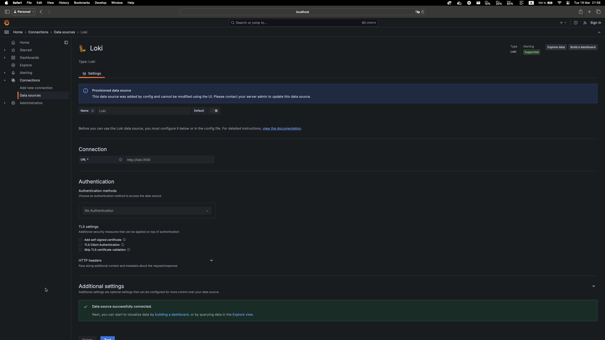
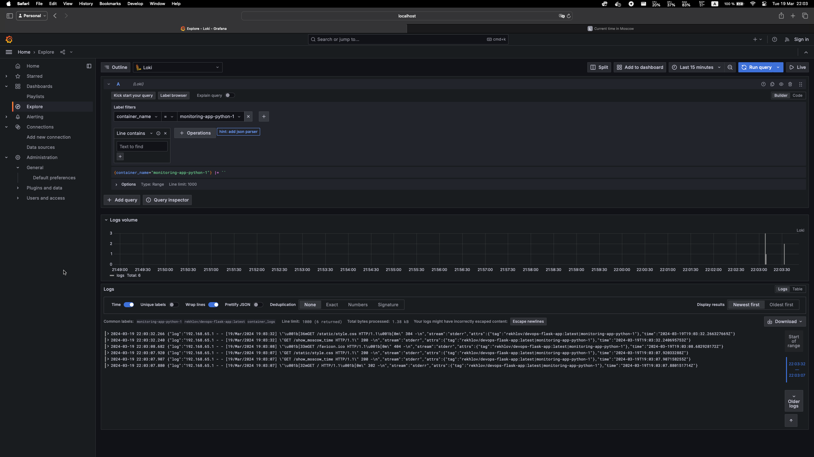

# Answers to Lab 7

## Components and their roles

### 1. Grafana

Grafana is a component within the stack that is used for querying and displaying log data. It provides a graphical
interface for visualizing and analyzing logs. With Grafana, you can create dashboards and panels to visualize log data
in various formats such as graphs, tables, and heatmaps. It also supports advanced features like alerting, which allows
you to set up notifications based on log data.

### 2. Loki

Loki is the main server component in the stack and is responsible for ingesting, storing, and processing logs. It is a
logs aggregation system that is designed to be highly scalable and cost-effective. Loki indexes metadata about logs,
such as labels, and compresses and stores log data in chunks in object stores.

### 3. Promtail

Promtail is an agent or client that is used to scrape logs, add labels to log streams, and push the streams to Loki
through an HTTP API. It is responsible for discovering log files and applications emitting log lines that need to be
monitored. Promtail can tail logs from local log files and the systemd journal.

## Test queries to the app-python:

